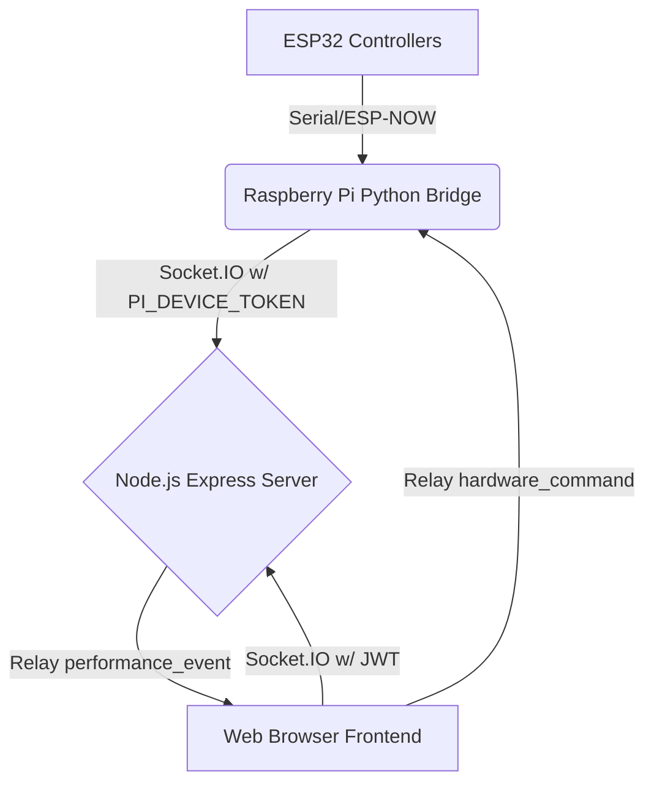

# Realtime Architecture for SynthWave Motion

This document outlines the architecture for real-time hardware integration via Socket.IO.

## Overview
The platform connects real hardware instruments (ESP32 via Raspberry Pi) to a Next/Vite frontend via a Node.js/Express WebSocket backend.

## Security
- **Browser Clients**: Must authenticate via JWT (obtained upon login).
- **Hardware Bridge**: Must authenticate via `PI_DEVICE_TOKEN`.

## Socket Rooms
- `web-clients`: Contains all connected browser sessions.
- `hardware-devices`: Contains the Raspberry Pi bridge(s).

## Data Flow
1. **Instrument Played**: ESP32 detects motion/button press -> Pi Bridge parses -> emits `performance_event` to Server.
2. **Server Routing**: Server receives event from a socket in `hardware-devices` room and broadcasts to `web-clients` room.
3. **Frontend Reaction**: The React frontend (via `SocketContext`) receives `performance_event` and updates global `hardwareState` instantly, rendering visual changes.
4. **Hardware Commands**: When a user selects a mode on the Dashboard, `sendHardwareCommand` emits to the server, which relays only to `hardware-devices`.
